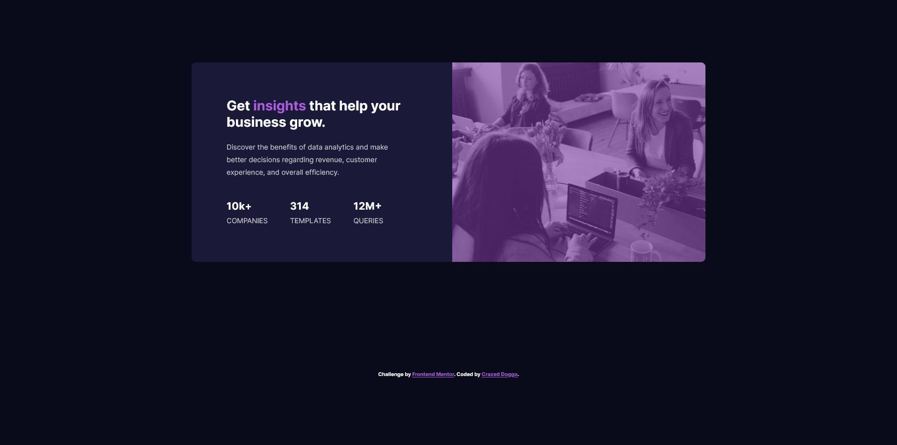

# Frontend Mentor - Stats preview card component solution

This is my personal solution to the [Stats preview card component challenge on Frontend Mentor](https://www.frontendmentor.io/challenges/stats-preview-card-component-8JqbgoU62).

## Table of contents

- [Overview](#overview)
  - [The challenge](#the-challenge)
  - [Screenshot](#screenshot)
  - [Links](#links)
- [My process](#my-process)
  - [Built with](#built-with)
  - [What I learned](#what-i-learned)
  - [Continued development](#continued-development)
  - [Useful resources](#useful-resources)
- [Author](#author)
- [Acknowledgments](#acknowledgments)

## Overview

### The challenge

Users should be able to:

- View the optimal layout depending on their device's screen size

### Screenshot



### Links

- Live Site URL: https://crazeddoggo.github.io/FrontendMentor-StatsPreviewCard-Solution

## My process

### Built with

- Semantic HTML5 markup
- CSS Variables
- CSS Grid and Flexbox
- Mobile-first workflow

### What I learned

This personally served as a great way for me to reinforce my current skills and apply what I've learnt. I've recently finished a course for CSS grid so I wanted to apply this here like-wise. This is most demonstrated by easily reshaping the card using media queries and simply reassigning grid areas to change the layout, for example:

```css
.card {
    display: grid;
    grid-template-columns: 1fr 1fr;
    grid-template-areas: 
    "image image"
    "text text";
    gap: 1em;
}
```
for mobile, and for desktop:
```css
.card {
    grid-template-areas: 
    "text image";
}
```

This re-arranged it and is much cleaner than my past options which would probably involving having to re-write everything with flexbox. That wouldn't be too major, but this is much cleaner and easier in my personal opinion.

What I *did* learn, however, mainly involves assigning a background image and overlapping it, notably the background property. Not much to really go on about, mainly just how to add that overlap and how to apply gradients to backgrounds.

### Continued development

What made building this site much easier was sitting back, outlining areas of the site, comparing them to the mobile layout or other queries, and then planning out a grid format with certain areas. This planning I did in advance made the responsive design aspect much easier and led to cleaner code.

### Useful resources

- [Image Overlays](https://dev.to/ellen_dev/two-ways-to-achieve-an-image-colour-overlay-with-css-eio) - Helped me with learning how to apply overlays and use backgrounds in a more readable way.

## Author

- GitHub - [CrazedDoggo](https://github.com/CrazedDoggo)
- Frontend Mentor - [@CrazedDoggo](https://www.frontendmentor.io/profile/CrazedDoggo)
